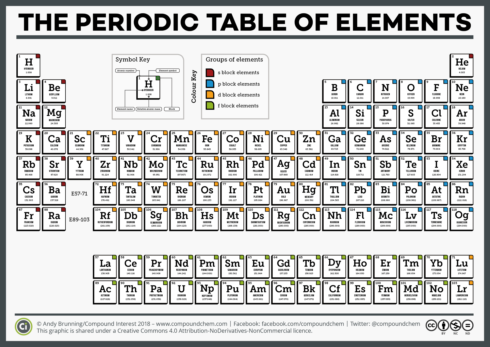

  
---

# 🌟 Periodic Table  

A sleek and interactive web-based representation of the Periodic Table of Elements. This project showcases all known chemical elements with their respective properties and allows users to explore details about each element easily.  

## 🚀 Features  
- Interactive Periodic Table layout.  
- Displays detailed information about each element, including:  
  - Atomic number  
  - Symbol  
  - Name  
  - Atomic mass  
  - Electron configuration  
- User-friendly design with responsive UI for all devices.  

## 🛠️ Technologies Used  
- **HTML**: Structure of the web app.  
- **CSS**: Styling for an attractive and clean interface.  
- **JavaScript**: Adds interactivity to the Periodic Table.  

## 📂 Project Structure  
```
PeriodicTable/
├── index.html   # Main HTML file  
├── style.css    # Stylesheet for design  
├── script.js    # JavaScript for interactivity  
└── README.md    # Documentation  
```  

## 💻 Getting Started  

### Prerequisites  
- A modern web browser (Chrome, Firefox, Edge, etc.)  
- Basic understanding of web technologies (optional).  

### Installation  
1. Clone the repository:  
   ```bash  
   git clone https://github.com/chrohangurjar/PeriodicTable.git  
   ```  
2. Navigate to the project directory:  
   ```bash  
   cd PeriodicTable  
   ```  
3. Open `index.html` in your browser to explore the Periodic Table.  

## 🧪 Demo  
[Live Demo](#) — *(Add the link to a live demo or GitHub Pages URL if available)*  

## 🤝 Contributing  
Contributions are welcome! Feel free to:  
- Fork the repository.  
- Submit pull requests with improvements or fixes.  

## 📜 License  
This project is licensed under the [MIT License](LICENSE).  

## 📧 Contact  
**Rohan Naagar**  
- GitHub: [@chrohangurjar](https://github.com/chrohangurjar)  
- Email: [Rohan150907@gmail.com](mailto:Rohan150907@gmail.com)  

---
